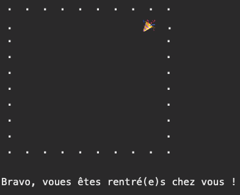
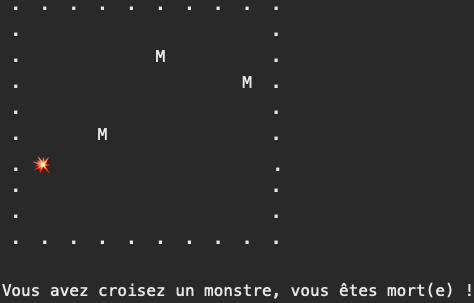

# Role Player Game

Ce projet écrit en `Java` simule une `Role Player Game` simplifiée. Le jeu se déroule dans la console. Nous avons un joueur, et des monstres. Et ça commence comme suit :

# Règles du jeu

Le joueur, commençant en bas et à gauche du tableau, essaie de rentrer chez lui, en haut et à droite du tableau. Le jeu se termine avec lui rentré, ou dévoré par un monstre, comme suit :

## Cas où on a gangé

## Cas où on a perdu

